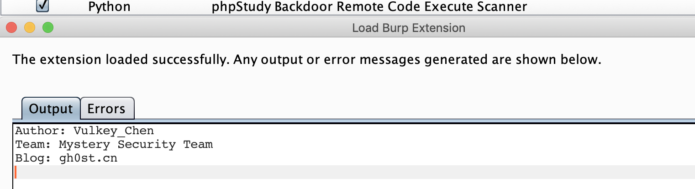
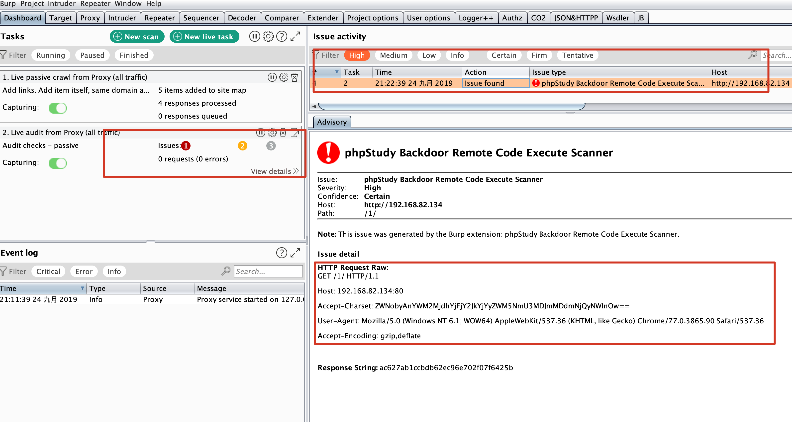

# BurpSuite-Extender-phpStudy-Backdoor-Scanner
About it : **phpStudy Backdoor Remote Code Execution Scanner**

## Usage

BurpSuite -> Tab:Extender -> Tab:Extensions -> Add 

## Scanner

doPassiveScan

